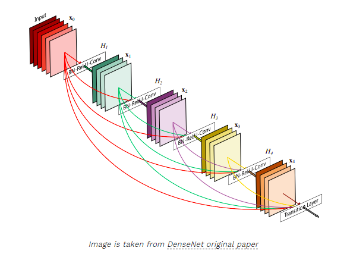

## A Survey of Deep Learning for Scientific Discovery

[Link to the paper](https://arxiv.org/abs/2003.11755)

Authors: *Maithra Raghu, Eric Schmidt*

Affiliation: *Cornell Univeristy and Schmidt Futures report*

Year: 2020

This paper presents an overview on fundamental deep learning (DL) models, tasks methods, the development and interpretability of DL models trained on less data than tradititonal applications (e.g. using data augmentation, or self-supervised models), and tutorials and codes for reference.

### The problems tackled by DL applications
* *Prediction problems* to map inputs to predicted outputs.
* *Predictions' interpretability*, when having accurate predictions is not enough, and an understanding on how those predictions were generated is required.
* *Transform complex input data*, e.g. massive visual data that needs to be processed efficiently.

### A typical deep learning workflow
Note the presence of iterative steps in the following pipeline. DL cannot be thought as a natural sequence with defined beginning and end.

### Most relevant DL libraries and resources

**Main software options**

* Pytorch --> Lightning (high level API)
* Tensorflow --> Keras (high level API)
  
**Where to find pre-trained models**

* [PyTorch](https://pytorch:org/docs/stable/torchvision/models:html)
* [TensorFlow](https://github:com/tensorflow/models)
* [Hugging Face](https://github:com/huggingface), famous for its Transformer models.
* https://github:com/rasbt/deeplearning-models
* https://github:com/hysts/pytorch_image_classification
* https://github:com/openai/baselines
* https://modelzoo:co/
* https://github:com/rusty1s/pytorch_geometric

**Visualization, Analysis and Compute Resources**

* [Tensorboard:](https://www:tensorflow:org/tensorboard) to visualize metrics such as loss and accuracy while the model is training.
* [Google Colab:](https://colab:research:google:com/notebooks/welcome:ipynb) interactive model development, analysis, and also provides some free computation resources.

### Standard Neural Network Models and Tasks

The authors here highlight the role of *supervised learning* as *"the most basic yet most critical method for training deep neural networks"*.

**1. Multilayer Perceptrons**  
The authors state those are the most basic DL models, as they are more expressive than logistic/linear regression models. I would say here, that MLP are more expressive than linear models in general, as they allow to tackle classification problems for which decision boundaries are nonlinear. The authors also highlight that typical linear models such would be a good first step to try. However, I would say it's almost mandatory to try them, along with a simple baseline model that allows us to benchmark if more complex solutions are actually adding more value vs relatively simple ones.

**2. Convolutional Neural Networks**  
By far, the most common family of NNs, highly used in computer vision applications. The most common use cases for CNNs are summarized in the following image:

**2.1. Image Classification**  
Most common architectures for image classification include: 
* *VGG*, a simple stack of convolutional layers followed by a fully connected layer.
* *ResNets* which are a family of convolutional networks of different sizes and depths and *skip connections*. Basic idea behind ResNets is to backpropagate through the identity function to preserve the gradient.

    

* *DenseNets*, where unlike standard neural networks, every layer in a "block" is connected to every other layer. This ensures a maximum flow of information between the layers, and the concatenation of the channel feature dimension results in highly compact models.
  
    

* More recently, *ResNeXt* and *EfficientNets*.

**2.2. Object Detection**  
In the authors words, while *"image classification can be thought of as a global summary of the image*, object detection focuses on the lower details of tha image that allow capturing and identifying specific details (e.g. objects) in them. DL models for object detection are composed by a *backbone* (an image classification model) and a *region proposal* component (to draw the bounding boxes around detected objects). Examples of the most common pre-trained models for such purpose are:

* Faster R-CNN.
* YOLOv3.
* EfficientDets.
* Mask R-CNN.

**2.3. Semantic Segmentation and Instance Segmentation**  
These applications intent to exploit the lowest levels of detail contained in the processed images, this is, categorize every single pixel in them. Example taken from the paper: suppose we are given an image of a street, with a road, different vehicles, pedestrians, etc. We would like to determine if a pixel is part of any pedestrian, part of any vehicle or part of the road. In instance segmentation, these pixels would be further subdivided into those belonging to pedestrian one, pedestrian two or pedestrian three.

**3. Super-Resolution**  
Super resolution is a technique for transforming low resolution images to high resolution images. This problem is considered to be undetermined because there multiple possible mappings of a high-resolution output that can be assigned to a single low-resolution image (fewer equations than unknowns). Some of the available architectures to solve this problem include:

* SRCNN
* Residual Dense Networks
* Predictive Filter Flow, which has also looked at image denoising and deblurring.
  
**4. Image Registration**  
Image registration considers the problem of aligning two input images to each other. For instance, when the two input images might be from different imaging modalities (e.g. a 3D scan and a
2D image).

**5. Pose Estimation**  
Pose estimation, and most popularly human pose estimation, studies the problem of predicting the pose of a human in a given image. DL models are trained to identify the location of the main joints, the keypoints (e.g. knees, elbows, head) of the person in the image. Widely used in neuroscience, these models help in the prediction of animal behavior. 

**6. Neural Networks for Sequence Data**  
When data has sequential structure (e.g. words in a sentence, aminoacid sequences in a protein), DL models need to be able to capture that special attribute. Sequential models are an extensive research field predominantly influenced by advances in Natural Language Processing (NLP). In particular, *machine translation* and *question answering* have been popular tasks. Within the machine translation tasks, we can find:

**6.1. Language Modelling (Next Token Prediction)**
Language modelling is a self-supervised learning method because the models used to learn from such tasks do not need to consider additional labels to the ones already set by the inputs (e.g. a sentence). In NLP, neural networks are fed with sequences of words so that the next one coming can be predicted.

**6.2. Sequence to Sequence Tasks**  
While next token prediction focuses on placing the correct entry that follows a sequence, seq-to-seq tasks transform the complete input sequence into another sequence. This is the typical application of translation machines. Sequence to sequence tasks typically rely on neural network models that have an encoder-decoder structure, with the encoder neural network
taking in the input sequence and learning to extract the important features, which is then used by the decoder neural network to produce the target output:

**6.3. Question Answering**  
Models employed for this task are given a paragraph of text (as context) and a specific question to answer on this context as input. It must then output the part of the paragraph that answers the question.

**6.3. Recurrent Neural Networks**  
Different from classical CNNs, or MLPs, RNNs were they first type of DL architecture useful for tasks that involved dealing with sequential data. The reason for this is that such NNs are not simply feedforward NNs that map an input to an output, but they include *feedback connections* that enable the preservation and modification of an internal state across timesteps (e.g. a sequence of words is processed token by token, and each of those tokens cause an update in the internal state of the RNN). This said, RNNs are great to deal with length-variable sequences of data, as they are able to keep for instance, the setences' context, usually key to generate a final output.

Typical RNNs include the GRUs (Gated Recurrent Units), but perhaps the most popular model is the bi-LSTM (bidirectional Long-Short Term Memory NNs) that incorporates a gating function to control the updates in the network, and runs both forward and backwards to process the sequences.

In practice, implementing bi-LSTM can be tricky because of:
* Exploding/vanishing gradients resulting from the challenges imposed by recursiveness.
* Longer training times (as required to output token by token).
* The need to learn from *long term sequential dependencies.*

Transformers have emerged to alleviate the first two challenges mentioned above.

**6.4. Attention**  
Learning from long-term sequential dependencies, or long-range dependencies has been a challenge for RNN, as it's often tricky to capture the context encapsulated by sequence tokens that are very far away from each other. As tokens are read in order, RNNs need to make sure the information coming from earlier tokens is not lost, as it may be needed at some point. This is why *Attention* is a very important concept for these DL models.

Attention basically introduces **shortcut connections** to early tokens so that the RNN can look back to relevant tokens when it's necessary. There is also a variant of this method known as *Self-Attention*, which can be used to help predictions on a single input sequence, and it's the core building block of Transformer models.

**6.5. Transformers**  
Once attention issues with RNNs seemed to be solved with the introduction of these popular shortcut connections, RNNs were still slow to train and often difficult to parameterize due to their exploding gradients. To alleviate this, the Transformer model was proposed, which is a feedforward DL model able to work with sequential data [based on the paper *Attention is all you need*.]. Transformes take the entire sequence and read it at once, but through *positional embeddings* they respect the original sequence order, so that context is not lost. Transformers are nowadays the most popular models to deal with many of the tasks imposed by sequential data.

Transformers were inspired by machine translation tasks, so they consist of an encoder-decoder architecture, that nevertheless has been adapted to tackle many other tasks such as question answering (where the encoder is used in a standalone way) and text generation (where the decoder is mainly involved).

Two very accessible step by step tutorials on the transformer are [The
Annotated Transformer](https://nlp.seas.harvard.edu/2018/04/03/attention.html) and [The Illustrated Transformer](http://jalammar.github.io/illustrated-transformer/). Moreover, the BERT (Pretraining of deep Bi-directional Transformers for Language understanding) model has been successfully proposed from the use of *transfer learning* in these architectures, and it has resulted very useful for some [NLP tasks](http://jalammar.github.io/illustrated-bert/).

### Key (Supervised Learning) Methods

**Transfer Learning**  
Transfer learning is a two step process for training a deep neural network model, a pretraining step, followed by a finetuning step, where the model in trained on the target task. The features used by the pretraining often lead to boosts in performance and convergence speed of the target task, as well as needing less labelled data. Thanks to these benefits, Transfer Learning is now widely used in several applications. As the authors state, *"Typically, performing transfer learning is an excellent way to start work on a new problem of interest. There is the benefit of using a well-tested, standard neural network architecture, aside from the knowledge reuse, stability and convergence boosts offered by pretrained weights".*

**Domain Adaptation**  
Originates from what Jeremy Howards defined as the problem of *domain shift* in his fastai course. Very often, we want to adapt DL models to be able to perform a given task on data instances whose inherent distribution differs from the one in the training data set, although both types of instances may look similar. They key for these models is to learn features that are as invariant to the domain shift as possible, while performing well on the source domain. Some techniques considered in this regard are *gradient reversal*, *adversarial training*, and more recently *self-supervision*. 

**Applications not covered by the authors of this paper: video prediction, action recognition, style transfer, structured prediction, and summarization**.
